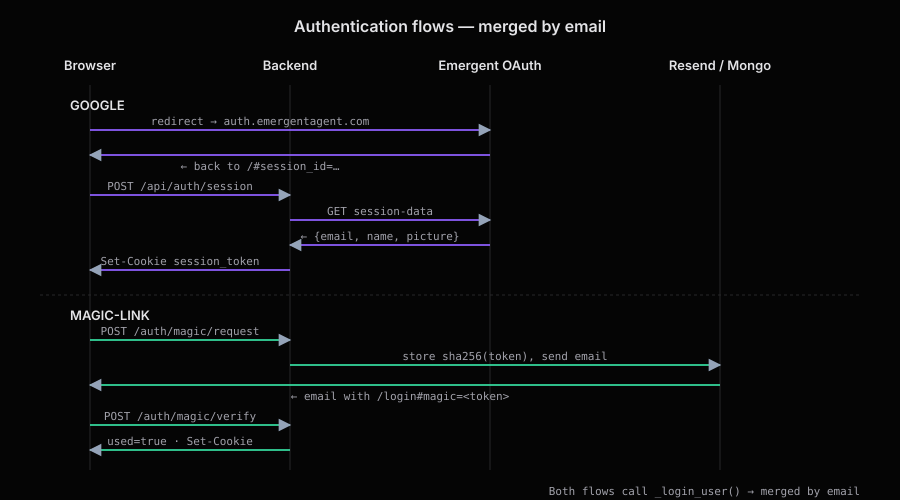

Authentication
==============

The Council supports **two sign-in methods** that resolve to the **same
account** when they use the same email address:

1. **Emergent Google OAuth**. One-click, delegated to
   ``https://demobackend.emergentagent.com/auth/v1/env/oauth/session-data``.
2. **Passwordless email magic-link**. Powered by Resend.

Both produce a **7-day session cookie** (or a bearer token for clients that
can't hold third-party cookies).

   Both flows converge in ``_login_user()`` which merges accounts by email.

Data model
----------

Two collections back auth:

.. list-table::
   :header-rows: 1
   :widths: 20 25 55

   * - Collection
     - Key
     - Fields
   * - ``users``
     - unique index on ``email``
     - ``user_id`` (``user_<12hex>``), ``email``, ``name``, ``picture``,
       ``created_at``.
   * - ``user_sessions``
     - lookup by ``session_token``
     - ``user_id``, ``session_token`` (32-byte URL-safe secret),
       ``expires_at`` (ISO UTC), ``created_at``.
   * - ``magic_links``
     - lookup by ``token_hash``
     - ``email``, ``token_hash`` (SHA-256 hex), ``used`` (bool),
       ``expires_at`` (+15 min), ``created_at``.

.. important::

   ``magic_links`` stores the **hash** of the token, never the token itself.
   The raw token only ever exists in the outbound email URL.

The ``get_current_user`` dependency
-----------------------------------

Every protected route depends on this function:

.. code-block:: python

   async def get_current_user(request: Request) -> User:
       token = request.cookies.get("session_token") \
               or request.headers.get("Authorization", "").removeprefix("Bearer ").strip()
       # look up user_sessions; verify expiry; load user
       _current_user_id.set(user["user_id"])   # <— fuels per-user settings
       return User(...)

Two mechanisms are supported so that:

* Browsers with third-party cookies enabled use the ``session_token`` cookie
  (SameSite=None, Secure, HttpOnly).
* Environments where cookies are blocked (embedded webviews, some
  cross-origin setups) can send ``Authorization: Bearer <session_token>``
  instead. The frontend stores the token in ``localStorage`` after magic-link
  verification for exactly this fallback.

Google sign-in flow
-------------------

.. code-block:: text

   Browser        Frontend            Backend                Emergent
     │  click       │                    │                       │
     ├─────────────►│  redirect to       │                       │
     │              ├── /auth/v1/env/oauth/authorize?... ───────►│
     │  (Google consent)                 │                       │
     │◄─────────────┤◄── redirect ?session_id=... ───────────────┤
     │              │  POST /api/auth/session {session_id}       │
     │              ├───────────────────►│                       │
     │              │                    │  GET session-data ───►│
     │              │                    │◄── {email,name,pic} ──┤
     │              │◄── Set-Cookie ─────┤                       │
     │              │ {user_id,email,…}  │                       │
     │  signed in   │                    │                       │

If a user already exists with the returned email, their ``name`` and
``picture`` are refreshed but the ``user_id`` is preserved.

Magic-link flow
---------------

.. code-block:: text

   Frontend                   Backend                 Resend        Inbox
     │  POST /auth/magic/request        │                             │
     ├─────────────►│                   │                             │
     │              │  store {email, sha256(token), exp+15min}        │
     │              │  send email with  │                             │
     │              ├── Resend API ────►│  deliver ──────────────────►│
     │◄── {ok:true} ┤                   │                             │
     │  user clicks link ────────────────────────────────────────────►│
     │  → Frontend loads /login#magic=<token>                          │
     │  AuthContext detects hash, POST /auth/magic/verify {token}     │
     │              │  hash(token); find unused, unexpired doc         │
     │              │  mark used=true; login user                     │
     │◄── Set-Cookie + user ─────────────                             │

Tokens are:

* **32 bytes** of ``secrets.token_urlsafe`` entropy.
* Stored as **SHA-256** hex only. Even a full DB dump won't reveal usable
  tokens.
* **Single-use**: verifying flips ``used=true`` before returning.
* **Short-lived**: 15-minute expiry (``expires_at`` set on request).

Merging accounts by email
-------------------------

Both flows call the internal ``_login_user(email, name, picture, response)``.
It looks up ``users`` by ``email``; if found, it refreshes ``name``/``picture``
and reuses the ``user_id``. If not, it inserts a fresh record. Result: signing
in with Google and later with a magic-link on the same email address gives
you the *same* account. Sessions, keys and settings are shared.

Session lifetime & cookies
--------------------------

* ``session_token`` cookie: ``HttpOnly; Secure; SameSite=None; Max-Age=7 days``,
  ``Path=/``.
* On logout, the row in ``user_sessions`` is deleted and the cookie is
  cleared. Expired sessions return 401 via the ``get_current_user`` check.
* CORS is configured with ``allow_credentials=True`` and an echoing origin
  regex so cookies work across preview subdomains.

Per-user isolation
------------------

Every data query in ``server.py`` scopes on ``owner=user.user_id``:

.. code-block:: python

   await db.sessions.find({"owner": user.user_id}, {"_id": 0})
   await db.settings.find_one({"_id": user.user_id})   # settings _id = user_id

There is no admin backdoor and no cross-user lookup path.

The user-id ContextVar
----------------------

``_current_user_id`` (``contextvars.ContextVar``) is set inside
``get_current_user`` and read by settings helpers (``get_settings``,
``get_provider_key``, ``get_openrouter_key``). This lets the LLM routing
helpers stay stateless while still resolving the caller's own keys.

.. warning::

   Never call those settings helpers from a background task that isn't part
   of the current request. The ContextVar won't be set. Pass ``user_id``
   through explicitly there instead.

Testing sign-in flows
---------------------

See :doc:`testing` and ``auth_testing.md`` at the repo root. Highlights:

* ``backend/tests/test_magic_link.py`` covers request/verify happy path,
  token replay rejection, and expiry.
* ``backend/tests/test_auth_gating.py`` verifies that protected routes
  return 401 without a session.
* ``backend/tests/test_isolation.py`` proves that user A cannot read
  user B's sessions/settings.
