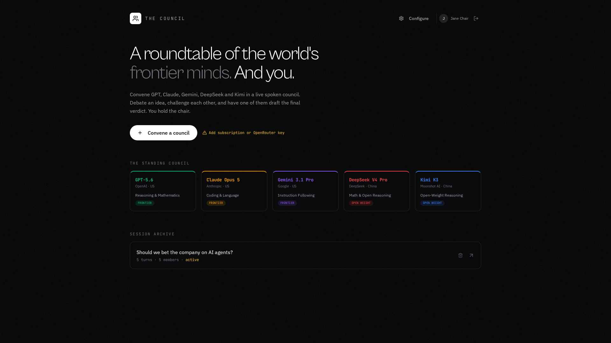

Getting Started
===============

Your first council in three minutes.

   The dashboard after sign-in. Convene a session, see the standing council, browse your archive.

1. Sign in
----------

Open the app and you land on the sign-in page. Pick one:

* **Sign in with Google**. One click, no password.
* **Create account** with email and a password of at least 8 characters.
* **Sign in** with an existing email and password.

See :doc:`signing-in` for details. If two methods use the same email address, they map
to the same account.

2. Connect at least one model (once)
------------------------------------

Click **Configure** in the top-right and pick one of these:

* Sign in with a **ChatGPT Plus / Pro** or **Claude Pro / Max** subscription (personal
  use only).
* Paste an **API key** for OpenAI, Anthropic, Google, DeepSeek or Moonshot.
* Paste an **OpenRouter** key as a universal fallback that covers all five providers.

Voices work automatically with no extra setup. See :doc:`settings-and-keys`.

.. tip::

   You don't need every option. Any single one (subscription, API key, or OpenRouter) is
   enough to start talking to the council.

3. Convene a council
--------------------

1. Click **Convene a council**.
2. Give it a topic. For example, *"Should we bet the company on agents?"*.
3. Pick which members take a seat. All are selected by default.
4. Click **Enter the chamber**.

4. Start the conversation
-------------------------

Inside the chamber you can:

* Click **Open the floor** to let the models start the discussion themselves.
* Type or **speak** your message, then click **Address council** for a full round table.
* Click any member's tile to have that model respond next.

The models reply out loud, one at a time, with their name shown in the live transcript.

5. Wrap up
----------

* **Peer review** has the members blind-rank each other. See the *Council Standings*.
* **Conclude** assigns one model to draft the final verdict.
* **Export PDF** downloads the full transcript, notes, standings and verdict.

Next: :doc:`running-a-council`.
