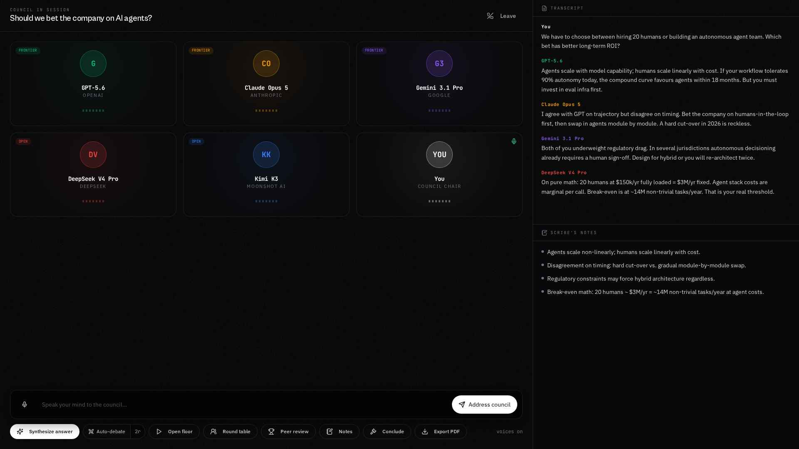

Running a Council
=================

Once inside the chamber, you drive the discussion.

   The chamber. Five model tiles plus your own on the left, transcript top-right, Scribe's notes bottom-right, control dock along the bottom.

The chamber layout
------------------

* **Center stage** has a tile for each model plus your own "You" tile. The currently
  speaking model glows and shows a live waveform. A "thinking…" state appears while it
  composes a reply.
* **Transcript** (top-right) records every turn, labelled with the speaker's name and colour.
* **Scribe's Notes** (bottom-right) captures key points automatically.

Control dock
------------

.. list-table::
   :header-rows: 1
   :widths: 25 75

   * - Control
     - What it does
   * - **Mic**
     - Push to record. Your speech is transcribed into the message box.
   * - **Address council**
     - Sends your message and runs one full round. Every member responds in turn.
   * - **Open the floor**
     - Lets the models open the discussion themselves. Useful to kick things off.
   * - **Round table**
     - Every seated member contributes once, in order.
   * - **Auto-debate (Nr)**
     - Members argue autonomously for N rounds, challenging each other. Click the
       number to change rounds. Press **Stop debate** to halt.
   * - **Peer review**
     - Members blind-rank each other's latest positions. See *Council Standings*.
   * - **Notes**
     - Refresh the Scribe's key points on demand.
   * - **Conclude**
     - Assign a member to draft the final written verdict.
   * - **Export PDF**
     - Download transcript, notes, standings and verdict.
   * - **voices on/off**
     - Mute or unmute spoken audio.

Addressing a single model
--------------------------

Click any member's tile to have that model respond next. Useful to ask a specialist
directly. For example, tap Claude for a coding question.

Personas (optional)
-------------------

By default each model uses its natural personality. In **Settings** you can give any
member a persona (for example, *"a fierce open-source advocate"*) to shape how it argues.

Council Standings (peer review)
-------------------------------

When you click **Peer review**, each member reads the others' latest positions
anonymously and ranks them on rigour and insight. The result is a leaderboard with a
score bar per member and a **"most convincing"** badge for the top-voted argument.
