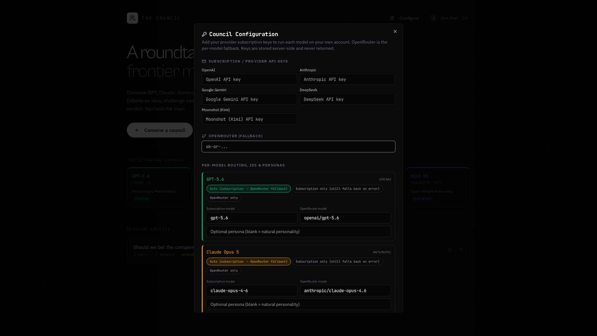

Settings & Keys
===============

The Council runs each model on **your own accounts**, so you stay in control of usage and
cost. Open **Configure** (top-right) to manage this. All keys are stored securely and are
**never shown back** to you or anyone else.

   Council Configuration: paste provider or OpenRouter keys, pick per-member routing and models, and add optional personas.

Three ways to power the models
------------------------------

**1. Subscription sign-in (personal use, experimental)**
   Reuse your existing **ChatGPT Plus / Pro** and **Claude Pro / Max** subscriptions
   instead of paying twice. Setup is a one-time paste of an OAuth token from your
   local CLI. See :ref:`subscription-setup` below.

**2. Provider API keys (billed per token)**
   Paste your own API key for any provider — OpenAI, Anthropic, Google Gemini, DeepSeek,
   or Moonshot (Kimi). That model then calls its provider directly and is billed to
   that provider account.

**3. OpenRouter (universal fallback)**
   Paste an OpenRouter key. It's used automatically for any model whose subscription
   / API key is missing or temporarily failing — one key covers all five providers.

.. important::

   Subscription sign-in is designed for **personal use** and marked *experimental*.
   Sharing subscription tokens with other users violates the provider's ToS
   (Anthropic explicitly banned it in Feb 2026). If The Council ever grows beyond
   just you, switch to API keys or OpenRouter.

.. _subscription-setup:

Connecting a subscription
-------------------------

Open **Configure** and scroll to the amber **Subscription sign-in** panel.

**Claude Pro / Max**

.. code-block:: bash

   npm install -g @anthropic-ai/claude-code
   claude setup-token
   # Follow the browser prompt to log in.
   # Copy the sk-ant-oat01-... token that's printed.

Paste it into the *Claude Pro / Max* field and click **Save configuration**.

**ChatGPT Plus / Pro**

.. code-block:: bash

   # Install the OpenAI Codex CLI (see openai.com/codex-cli)
   codex login
   # Log in with your ChatGPT account in the browser.
   cat ~/.codex/auth.json     # copy the entire contents

Paste the whole JSON blob into the *ChatGPT Plus / Pro* field. The Council will
handle token refresh automatically for as long as the refresh token is valid.

Per-model routing
-----------------

For each member you can choose how it's routed:

* **Auto** — subscription first (if connected), then API key (if set), then OpenRouter.
* **Subscription** — force subscription for this model (falls back on hard errors).
* **API key** — force the provider's own API key.
* **OpenRouter only** — always use OpenRouter.

You can also edit each member's **subscription model name** and **OpenRouter model ID** if
you want to pin a specific model version, and give an optional **persona**.

Voices
------

Voice (models speaking, and transcribing your mic) works out of the box — no key needed.

Fallback is per-model
---------------------

If, say, your DeepSeek key hits a limit, only **DeepSeek** falls back to OpenRouter for
that turn — every other model keeps using your subscription. Nothing else is affected.
