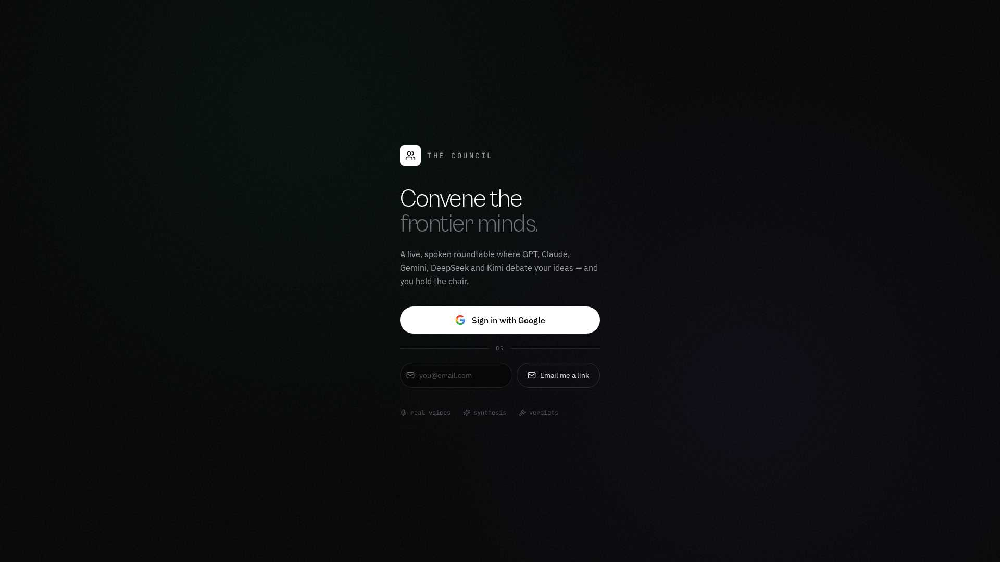

Signing In
==========

The Council is multi-user. Everyone has their own private sessions, notes and keys. There
are three ways to sign in, and they map to a single account when they use the same email
address.

   The sign-in page. Pick Google, or create an account with email and password.

Sign in with Google
--------------------

Click **Sign in with Google** and complete the Google prompt. You return to the app
already signed in.

Email and password
------------------

1. Click the **Create account** tab.
2. Enter your email, a password of at least 8 characters, and optionally your name.
3. Click **Create account**. You land on the dashboard signed in.

Next time, use the **Sign in** tab with the same email and password.

Email magic-link (optional)
---------------------------

If the app owner has configured email delivery, you can also request a one-time sign-in
link at ``/auth/magic/request``. Links are single-use and expire after 15 minutes. This
UI is off by default because it depends on an email provider being configured.

One account per email
---------------------

If you first sign in with Google using ``jane@example.com`` and later use email and
password with the same address, it's the same account. Your sessions and settings are
shared.

Signing out
-----------

Click the **logout** icon in the top-right of the dashboard. Your session ends and you
return to the sign-in page.

Troubleshooting
---------------

* **"Incorrect email or password."** Retype carefully. Passwords are case-sensitive.
* **"An account with this email already exists."** Use the **Sign in** tab instead.
* **Network error on sign-in.** Reload the page. If you got here from a bookmarked link,
  try the current preview URL.
